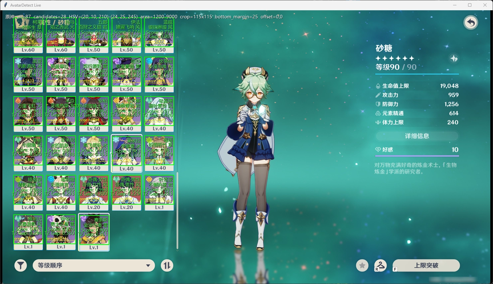

# AvatarDetect

> [!IMPORTANT]
> 本项目的代码、配置、文档和项目结构主要由 AI 生成。

用于训练和测试原神角色头像/角色卡识别模型。模型导出为 `ONNX + prototypes.csv`，推理时按 `variant_id` 进行 embedding 检索，返回角色、皮肤和元素信息。



## 数据目录

仓库只提交代码、配置、示例 CSV、目录占位和 JSON 元数据；不提交训练 PNG、checkpoint、ONNX、prototypes、生成 labels 或测试截图。

本地资源放置：

```text
assets/
  icons/
    UI_AvatarIcon/    角色透明头像或皮肤图（^UI_AvatarIcon_[^_]+$）
    UI_Buff_Element/  左上角元素图标（UI_Buff_Element_.*?）
  backgrounds/
    UI_QUALITY/       可选稀有度背景图（UI_QUALITY_.*?）
  overlays/
    training/         可选右下角养成进度图标（UI_TrainingGuide.*?）

data/
  metadata/
    Avatar/       角色 JSON 元数据
  generated/      生成的 labels.csv
  real_val/       真实游戏截图裁剪图，本地验证用
```

PNG 文件名必须保持 JSON 中的原始 `Icon` / `FrontIcon` 名称，例如 `UI_AvatarIcon_Ayaka.png`。

## 环境安装

推荐使用 Python 3.11。安装完整训练环境：

```powershell
python -m pip install -r requirements.txt
```

如果需要 GPU 训练，在基础安装后按自己的显卡驱动和 CUDA 版本，从 PyTorch 官网选择对应命令重装 `torch`。例如 CUDA 12.1：

```powershell
python -m pip install --force-reinstall torch==2.5.1 --index-url https://download.pytorch.org/whl/cu121
```

如果 Windows PowerShell 里中文输出乱码，先执行：

```powershell
[Console]::OutputEncoding = [System.Text.Encoding]::UTF8
$env:PYTHONIOENCODING = "utf-8"
```

## 已有模型快速测试

如果已经有兼容本项目的训练结果，只需要准备：

- `outputs/avatar.onnx`
- `outputs/prototypes.csv`
- `configs/train.yaml`

模型必须与当前 labels/prototypes 生成规则兼容，否则推理类别、向量维度或归一化参数可能不匹配。

```powershell
.\avatardetect.ps1 infer --image test\a.png
.\avatardetect.ps1 real-val
```

## 首次使用流程

本仓库不包含训练 PNG。使用前需要自行获取素材，并按目录放好：

1. 放置角色 JSON：`data/metadata/Avatar/*.json`。
2. 放置角色头像 PNG：`assets/icons/UI_AvatarIcon/`。
3. 放置元素图标 PNG：`assets/icons/UI_Buff_Element/`。
4. 可选放置稀有度背景 PNG：`assets/backgrounds/UI_QUALITY/`。默认训练不依赖背景 PNG，会对透明区域自动填色。
5. 可选放置养成进度图标：`assets/overlays/training/`。默认配置关闭右下角养成图标。
6. 菜单选择 `1. 准备数据`，或运行 `.\avatardetect.ps1 prepare`。
7. 校验通过后，菜单选择 `2. 开始完整训练`，或运行 `.\avatardetect.ps1 train`。

根据 [data/labels.example.csv](data/labels.example.csv) 可检查生成标签结构：

```csv
variant_id,character_id,character_name,skin_id,skin_name,element_type,weapon_type,rarity,image_path,element_icon_path,background_path,split
10000002_200200_冰,10000002,神里绫华,200200,莹辉流华,冰,单手剑,5,assets/icons/UI_AvatarIcon/UI_AvatarIcon_Ayaka.png,assets/icons/UI_Buff_Element/UI_Buff_Element_Frost.png,,train
```

保持 `variant_id` 和 `character_id` 稳定。`appearance_id` 在代码内部由 `character_id + "_" + skin_id` 派生，不写入生成 CSV。
`weapon_type` 由 Avatar JSON 的 `Weapon` 映射得到：`1=单手剑`、`10=法器`、`11=双手剑`、`12=弓`、`13=长柄武器`。

## 常用命令

不传参数会进入菜单：

```powershell
.\avatardetect.ps1
```

准备数据：

```powershell
.\avatardetect.ps1 prepare
```

从头训练并导出：

```powershell
.\avatardetect.ps1 train
```

单图测试：

```powershell
.\avatardetect.ps1 infer --image test\a.png
```

真实截图验证：

```powershell
.\avatardetect.ps1 real-val
```

实机窗口测试：

```powershell
.\avatardetect.ps1 live
```

`.\avatardetect.ps1 live` 会查找原神窗口，实时截图、按 HSV 参数定位候选头像区域，并裁剪后使用 `outputs/avatar.onnx` 和 `outputs/prototypes.csv` 输出识别结果。控制窗口可以调整 HSV、面积和裁剪参数，按 `T` 打印当前候选 Top5，按 `S` 保存当前裁剪图。

生成合成预览图：

```powershell
.\avatardetect.ps1 preview
```

如果没有激活 conda 环境，可以指定 Python：

```powershell
.\avatardetect.ps1 -Python C:\ProgramData\anaconda3\envs\avatardetect\python.exe prepare
```

## 步骤说明

菜单中的每个步骤会执行以下操作：

- `1. 准备数据`：生成 `data/generated/labels.csv`，检查 Python 语法，并按 `configs/train.yaml` 校验图片、可选背景、标签字段是否可用。对应命令：`.\avatardetect.ps1 prepare`。
- `2. 开始完整训练`：先准备数据，再清理旧的全量训练产物，然后从头训练，最后生成 `outputs/prototypes.csv` 并导出 `outputs/avatar.onnx`。对应命令：`.\avatardetect.ps1 train`。
- `3. 单图测试`：提示输入一张图片路径，使用 `outputs/avatar.onnx` 和 `outputs/prototypes.csv` 输出 TopK 识别结果。对应命令：`.\avatardetect.ps1 infer --image test\a.png`。
- `4. 真实截图验证`：读取 `data/real_val.csv`，对真实裁剪图做批量验证。对应命令：`.\avatardetect.ps1 real-val`。
- `5. 实机测试`：查找原神窗口，实时截图、定位候选头像区域、裁剪并识别；可在控制窗口调整 HSV、面积和裁剪参数。对应命令：`.\avatardetect.ps1 live`。
- `6. 生成预览图`：根据当前 labels 和配置生成合成预览图到 `outputs/previews/`，用于检查头像、自动填色背景、元素和可选养成图标合成效果。对应命令：`.\avatardetect.ps1 preview`。
- `7. 清理生成物`：删除生成物和缓存，包括 `outputs/`、`data/generated/labels.csv`、`temp/` 和 `__pycache__/`；不会删除 `assets/` 下的训练 PNG。对应命令：`.\avatardetect.ps1 clean`。

高级命令：

- `prototypes`：用指定 checkpoint 重新生成 `prototypes.csv`，通常在训练完成后使用。
- `export`：用指定 checkpoint 重新导出 ONNX，通常在训练完成后使用。
- `train --skip-cleanup`：执行完整训练流程，但训练前不清理旧的 `outputs/checkpoints/`、`outputs/prototypes.csv`、`outputs/avatar.onnx`。

## 识别规则

- 模型为每个 `variant_id` 学习一个 embedding。
- `variant_id` 表示 `character_id + skin_id + element_type` 的外观与元素组合。
- `appearance_id` 不写入生成 CSV，由 `character_id` 和 `skin_id` 派生表示角色皮肤。
- 推理时从 prototype 向量库映射回 `character_id`、`skin_name`、`element_type` 和 `weapon_type`。
- `weapon_type` 由 Avatar JSON 的 `Weapon` 字段映射得到，只作为跟随角色的元数据保存，不作为额外训练目标。
- 默认训练图会先在角色透明图原始画布上合成左上角元素图标，再整体缩放到 `115x115`，并用随机纯色、渐变或噪声背景填充透明区域。
- prototype 和验证默认使用按稀有度选择的纯色背景；如需恢复真实稀有度背景，可设置 `compose.use_background: true` 并提供 `background_path`。
